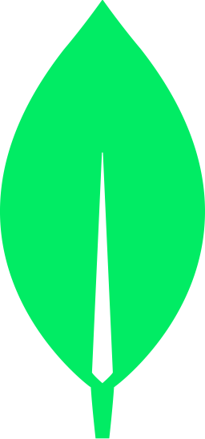
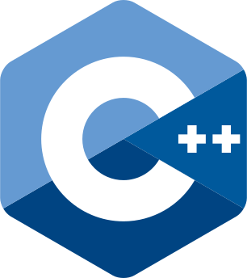

#  Hi there 👋🏻, I'm José Rafael

### Self-taught developer from Cuba 🇨🇺, currently focused on Web Development 👨🏻‍💻.

## 💬 Contact
- [**Portfolio**](https://jose-rafael.pages.dev/)
 
- [ **Email**](mailto:joserafaelperezr@icloud.com)

- [ **Telegram**](https://t.me/jose_rafael016)

- [ **WhatsApp**](https://wa.me/+5356843843?text=Hola!!)

## 👥 Social
- [ **LinkedIn**](https://www.linkedin.com/in/joserafael016/) 

- [ **Instagram**](https://www.instagram.com/jrwebdev/)  

- [ **Twitter**](https://twitter.com/jose_rafael016)  

- [ **TikTok**](https://www.tiktok.com/@jose_rafael016?lang=en)  

- [ **Facebook**](https://www.facebook.com/joserafael.perezrivero.3/)  

## 🛠️ Skills

### Front-End
<table align="center">
  <tr>
    <td align="center" width="96">
      
       HTML
    </td>
    <td align="center" width="96">
      
       CSS
    </td>
    <td align="center" width="96">
      
       JavaScript
    </td>
    <td align="center" width="96">
      
       TypeScript
    </td>
    
  </tr>
  <tr>
    <td align="center" width="96">
      
       Sass
    </td>
    <td align="center" width="96">
      
       PostCSS
    </td>
    <td align="center" width="96">
      
       Tailwind CSS
    </td>
    <td align="center" width="96">
      
       Astro
    </td>
  </tr>
</table>
 

### Back-End
<table align="center">
  <tr>
    <td align="center" width="96">
      
       Node.js
    </td>
  </tr>
</table>
 

### Tools
<table align="center">
  <tr>
    <td align="center" width="96">
      
       Git
    </td>
    <td align="center" width="96">
      
       GitHub
    </td>
    <td align="center" width="96">
      
       Vite
    </td>
    <td align="center" width="96">
      
       NPM
    </td>
  </tr>
  <tr>
    <td align="center" width="96">
      
       Bun
    </td>
  </tr>
</table>
 

### Learning
<table align="center">
  <tr>
    <td align="center" width="96">
      
       ReactJS
    </td>
    <td align="center" width="96">
      
       MongoDB
    </td>
    <td align="center" width="96">
      
       MySql
    </td>
  </tr>
</table>
 

### Others
<table align="center">
  <tr>
    <td align="center" width="96">
      
       Linux
    </td>
    <td align="center" width="96">
      
       C++
    </td>
  </tr>
</table>
 

## 📊 Github Stats

  
   
   
  
  
   
  

